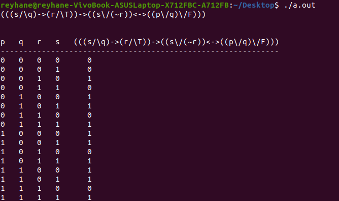

# Truth-Table  
program for drawing truth table of well formed formula using c++  
in this program use /\ for and, \/ for or, ~ for not, -> for conditional and <-> for two-conditional  
# Example  
  

